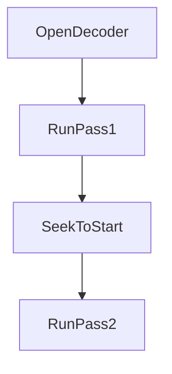

# ffgo Remaining Gaps — Implementation Design

**Status**: Implemented (2026-01-16)  
**Audience**: Contributors implementing remaining gaps  
**FFmpeg versions**: 4.x–7.x  
**Platforms**: Linux/macOS/Windows/FreeBSD on amd64/arm64 (`CGO_ENABLED=0`)

This document specifies APIs, internal architecture, FFmpeg mappings, and tests for:
- Device enumeration (`ListDevices`)
- Multi-pass encoding (2-pass)
- Advanced format probing controls
- Segmentation helpers (HLS/DASH/concat-style workflows)
- Color space/range helpers
- Multi-platform shim distribution

## Goals
- Define **implementable** public APIs with clear behavior.
- Specify internal changes (packages/files) and FFmpeg calls/options used.
- Keep optional functionality **graceful** when an FFmpeg component is missing.
- Provide a **test matrix** (unit vs integration + skip conditions).

## Non-goals
- Full FFmpeg surface coverage.
- A full streaming server/client implementation.
- UI/device picker beyond returning device descriptors.

## Constraints & existing touchpoints
- `purego` limitations apply (struct-by-value on non-Darwin, callback limits).
- Optional FFmpeg libs must be dynamically loaded:
  - `libavdevice` (device capture + enumeration)
  - `libswscale` (colorspace conversion hooks)
- Code touchpoints:
  - Library loader: `/home/okecho/nonibytes/ffgo/internal/bindings/bindings.go`
  - Shim loader: `/home/okecho/nonibytes/ffgo/internal/shim/shim.go`
  - Shim source: `/home/okecho/nonibytes/ffgo/shim/ffshim.c`, `/home/okecho/nonibytes/ffgo/shim/ffshim.h`
  - Capture APIs: `/home/okecho/nonibytes/ffgo/capture.go`
  - avdevice minimal loader: `/home/okecho/nonibytes/ffgo/avdevice/avdevice.go`
  - Decoder/Encoder: `/home/okecho/nonibytes/ffgo/decoder.go`, `/home/okecho/nonibytes/ffgo/encoder.go`
  - Custom I/O: `/home/okecho/nonibytes/ffgo/io.go`
  - Muxer: `/home/okecho/nonibytes/ffgo/muxer.go`

---

## 1) Device enumeration (`ListDevices`)

### Problem
`ListDevices` currently returns “not implemented”. We want enumeration via FFmpeg’s `libavdevice` where available, without CGO.

### Public API
Keep:

```go
func ListDevices(deviceType DeviceType) ([]DeviceInfo, error)
```

Add (optional, for power users):

```go
type DeviceListOptions struct {
    InputFormat string            // e.g. "v4l2", "alsa", "dshow", "avfoundation"
    DeviceName  string            // optional selector string
    AVOptions   map[string]string // forwarded options
}

func ListDevicesWithOptions(deviceType DeviceType, opts *DeviceListOptions) ([]DeviceInfo, error)
```

### Error model
Add typed errors (prefer `errors.go`):

```go
var ErrAVDeviceUnavailable = errors.New("ffgo: libavdevice not available")
var ErrDeviceEnumerationUnavailable = errors.New("ffgo: device enumeration not available")
```

`ListDevices*` should return:
- `ErrAVDeviceUnavailable` if `libavdevice` cannot be loaded
- `ErrDeviceEnumerationUnavailable` if the FFmpeg build/platform cannot enumerate even though `libavdevice` is present

### FFmpeg mapping
Use the official enumeration API:
- `avdevice_register_all()`
- `avdevice_list_input_sources(...)`
- `avdevice_free_list_devices(...)`

### Internal architecture
We want to avoid parsing FFmpeg structs via offsets in Go. Use shim wrappers to translate to primitive data.

#### Shim additions (`shim/ffshim.c` + `shim/ffshim.h`)

```c
int ffshim_avdevice_list_input_sources(
    const char *format_name,
    const char *device_name,
    void *avdict_opts,     // AVDictionary* (nullable)
    int *out_count,
    char ***out_names,
    char ***out_descs
);

void ffshim_avdevice_free_string_array(char **arr, int count);
```

Shim behavior:
- Ensure `avdevice_register_all()` was called (static guard).
- Resolve `AVInputFormat*` by name via `av_find_input_format(format_name)`.
- Call `avdevice_list_input_sources(fmt, device_name_or_null, &dict, &list)`.
- Copy strings into new allocations (e.g. `av_strdup`) and return arrays.
- Free the FFmpeg list with `avdevice_free_list_devices(&list)`.
- Provide `ffshim_avdevice_free_string_array` that frees each entry + the array using `av_free`.

#### Go implementation (`capture.go`)
- Ensure FFmpeg core is loaded (`bindings.Load()`).
- Ensure `libavdevice` is loaded/registered (`avdevice.RegisterAll()`), else return `ErrAVDeviceUnavailable`.
- Build `avutil.Dictionary` from `opts.AVOptions`, pass it through shim call.
- Convert returned `char**` to Go strings and populate `[]DeviceInfo`.
- Always free arrays via shim free function.

### Platform defaults
Reuse capture defaults already used in `/home/okecho/nonibytes/ffgo/capture.go`:
- Linux: video `v4l2`, audio `alsa`
- macOS: `avfoundation`
- Windows: `dshow`

### Tests
- Unit:
  - Validate device-type→default input format mapping.
  - Validate error typing when `libavdevice` unavailable.
- Integration (skippable):
  - If `libavdevice` loads, call `ListDevices(DeviceTypeVideo)` and assert no crash.
  - Accept either a non-empty list or a meaningful error (permissions/OS constraints).
  - Run enumeration in a loop (e.g. 50–100 iterations) to smoke-test memory discipline.

---

## 2) Multi-pass encoding (2-pass)

### Problem
ffgo supports advanced codec options but lacks a coordinated 2-pass helper and API fields.

### Public API
Extend `EncoderOptions` (`/home/okecho/nonibytes/ffgo/encoder.go`):

```go
type EncoderOptions struct {
    // existing fields...

    Pass       int    // 0 disabled; 1 or 2 for pass number
    PassLogFile string // base path; if empty ffgo creates temp base
    PassOutput  string // optional override for pass1 output
}

func TwoPassTranscode(input, output string, opts *EncoderOptions) error
```

### Behavior
- Pass 1:
  - Requires seekable input (file, or seekable reader).
  - Sets codec context flags `AV_CODEC_FLAG_PASS1` and passes `passlogfile`/`stats` to the encoder.
  - Writes output to a temporary file (pass 1 output is discarded).
- Pass 2:
  - Sets codec context flags `AV_CODEC_FLAG_PASS2`, uses same passlog base.
  - Writes to real output via existing encoder path.

### FFmpeg mapping
Two-pass is controlled via codec context flags and encoder-private stats options:
- `AV_CODEC_FLAG_PASS1` / `AV_CODEC_FLAG_PASS2` on `AVCodecContext.flags`
- encoder options: `passlogfile` and/or `stats` (string)

Implementation note:
- `libx265` does not expose `passlogfile`/`stats` as FFmpeg AVOptions; use `x265-params` (`pass=N:stats=<file>`) instead.

Important codec caveats:
- Some encoders do not implement multi-pass; treat that as an error if user explicitly requests 2-pass.
- x264/x265 typically support it; others may not.

### Internal design
#### Where to implement
- Apply pass options where other video codec options are applied (currently `applyVideoOptions` in `encoder.go`).

#### Helper flow



Implementation details:
- Use a single `Decoder` and call `decoder.Seek(0)` between passes.
- Ensure `PassLogFile` base is stable:
  - If empty: create temp base via `os.CreateTemp(dir, "ffgo-passlog-*")`, then close+delete file, and use its name as base.
  - Cleanup any generated stats files on success/failure unless user provided `PassLogFile` (cleanup is prefix-based since encoders may add suffixes).

### Tests
- Integration (skippable if `ffmpeg` binary missing):
  - Generate short synthetic video with `ffmpeg`.
  - Run `TwoPassTranscode`.
  - Assert output exists and has video stream.
  - Assert passlog files exist after pass1, and are cleaned up appropriately if ffgo created them.

---

## 3) Advanced format probing controls

### Problem
Probing is configurable in FFmpeg but ffgo currently requires raw `AVOptions` maps.

### Public API
Extend `DecoderOptions` (`decoder.go`):

```go
type DecoderOptions struct {
    // existing fields...
    AVOptions map[string]string

    ProbeSizeBytes  int
    AnalyzeDuration time.Duration
    MaxProbePackets int
    FormatWhitelist []string
    CodecWhitelist  []string
}
```

Add functional options:

```go
func WithProbeSize(n int) DecoderOption
func WithAnalyzeDuration(d time.Duration) DecoderOption
func WithMaxProbePackets(n int) DecoderOption
func WithFormatWhitelist(v ...string) DecoderOption
func WithCodecWhitelist(v ...string) DecoderOption
```

### FFmpeg mapping
Map to AVDictionary entries passed to `avformat_open_input`:
- `probesize` (bytes)
- `analyzeduration` (microseconds)
- `max_probe_packets` (int)
- `format_whitelist` (comma-separated)
- `codec_whitelist` (comma-separated)

### Internal design
- In `NewDecoderWithOptions`, start from `opts.AVOptions`, then overlay typed fields if set.
- Preserve backwards compatibility: user-provided `AVOptions` should win unless explicitly overridden (choose one policy and document it; recommended: typed fields override to avoid ambiguity).

### Tests
- Unit: verify mapping output.
- Integration: with tiny `probesize`, input may fail to identify streams; assert the error propagates.

---

## 4) Segmentation helpers (HLS/DASH/concat workflows)

### Problem
FFmpeg muxers exist (`hls`, `dash`), but ffgo lacks configuration helpers and header-option plumbing in `Muxer`.

### Public API

```go
type HLSSegmenterConfig struct {
    SegmentTime            time.Duration
    ListSize               int
    SegmentFilenamePattern string
    Flags                  []string
    AVOptions              map[string]string
}

func NewHLSSegmenter(playlistPath string, cfg *HLSSegmenterConfig) (*Muxer, error)

type DASHSegmenterConfig struct {
    SegmentTime time.Duration
    InitName    string
    MediaName   string
    AVOptions   map[string]string
}

func NewDASHSegmenter(mpdPath string, cfg *DASHSegmenterConfig) (*Muxer, error)
```

### Required Muxer changes
Add header options support:

```go
func (m *Muxer) WriteHeaderWithOptions(opts map[string]string) error
```

Implementation:
- Build `avutil.Dictionary` from `opts` and call `avformat.WriteHeader(m.formatCtx, &dict)`.
- Free dict afterward.

### FFmpeg mapping
HLS (format `hls`):
- `hls_time` (seconds)
- `hls_list_size`
- `hls_segment_filename`
- `hls_flags` (comma-separated)

DASH (format `dash`):
- `seg_duration` (seconds)
- `init_seg_name`
- `media_seg_name`

### Internal design
- `NewHLSSegmenter`:
  - `m, err := NewMuxer(playlistPath, "hls")`
  - return `m` after caller adds streams; caller calls `WriteHeaderWithOptions(hlsOpts)` then writes frames/packets.
- Same shape for DASH.
- No custom state machine: let FFmpeg’s muxer handle segmentation.

### Tests
- Integration (skippable if muxer missing):
  - Create temp dir.
  - Build muxer with `NewHLSSegmenter`.
  - Add a simple video stream and write enough frames for >1 segment.
  - Assert playlist and segment files exist.

---

## 5) Color space / range helpers

### Problem
ffgo doesn’t expose explicit AVFrame color metadata setters/getters or controlled colorspace conversion.

### Public API
Add enums + a struct (place in new `color.go` in root package):

```go
type ColorRange int32
type ColorSpace int32
type ColorPrimaries int32
type ColorTransfer int32

type ColorSpec struct {
    Range     ColorRange
    Space     ColorSpace
    Primaries ColorPrimaries
    Transfer  ColorTransfer
}

func (f Frame) ColorSpec() ColorSpec
func (f Frame) SetColorSpec(spec ColorSpec)
```

Optional scaler hook:

```go
func (s *Scaler) SetColorConversion(src, dst ColorSpec) error
```

### Implementation approach
#### AVFrame metadata access
Two viable approaches:
- **A1: offsets verified in docs** (fast, but risks drift across FFmpeg versions)
- **A2 (recommended): offset discovery via shim** (stable)

Recommended: extend shim to export offsets for the required AVFrame fields using `offsetof(AVFrame, ...)`. Go caches these offsets and reads/writes via `unsafe.Add`.

#### Colorspace conversion
Bind swscale functions if present:
- `sws_getColorspaceDetails`
- `sws_setColorspaceDetails`

Expose only deterministic conversion settings; leave pixel conversion/scaling to existing scaler pipeline.

### Tests
- Unit:
  - Allocate `FrameAlloc()`, set color fields, read back.
- Integration (skippable if swscale APIs missing):
  - Apply `SetColorConversion` on a `Scaler` and validate metadata propagation.

---

## 6) Multi-platform shim distribution

### Problem
Shim-dependent features (logging, chapter writing, future avdevice wrappers) need a clear packaging strategy across OS/arch.

### Recommended approach (Option A + Option C)
#### Option A: ship prebuilt shims
Add repo layout:
- `shim/prebuilt/linux-amd64/libffshim.so`
- `shim/prebuilt/linux-arm64/libffshim.so`
- `shim/prebuilt/darwin-amd64/libffshim.dylib`
- `shim/prebuilt/darwin-arm64/libffshim.dylib`
- `shim/prebuilt/windows-amd64/ffshim.dll`
- `shim/prebuilt/windows-arm64/ffshim.dll`

Update `/home/okecho/nonibytes/ffgo/internal/shim/shim.go` `findShimLibrary()` to search:
- `FFGO_SHIM_DIR` env override (highest priority)
- executable directory
- system library paths
- `<module_root>/shim/prebuilt/<goos>-<goarch>/...` (for dev/testing)

#### Option C: installer command (optional)
Add `cmd/ffgo-install-shim`:
- downloads shim from GitHub release assets
- verifies checksums
- writes to user-selected directory (not system dirs by default)

### Tests
- Unit: `findShimLibrary` honors `FFGO_SHIM_DIR` and chooses correct filename per `GOOS/GOARCH`.

---

## Test matrix & skip conditions (implementation-ready)

### Unit tests (always run)
| Area | What to test | Where |
|------|--------------|-------|
| Probing options | typed fields → correct dict keys/values | new unit tests in `decoder_test.go` or `ffgo_test.go` |
| Two-pass config | passlog base generation + cleanup policy | new unit tests |
| Shim path resolution | env override + filename selection | new unit tests in `internal/shim` |
| ColorSpec | set/get roundtrip on allocated frames | new unit tests |

### Integration tests (skippable)
Integration tests must be written to **skip** when prerequisites are missing.

| Feature | Requires | Skip condition |
|--------|----------|----------------|
| ListDevices | `libavdevice` + OS permissions | `avdevice.Init()` fails OR enumerate returns “not supported” |
| CaptureScreen | OS capture + permissions | no display/permissions |
| Two-pass | `ffmpeg` binary for fixture generation + encoder support | `ffmpeg` missing OR encoder rejects `pass` |
| HLS/DASH | FFmpeg built with `hls`/`dash` muxers | `NewMuxer(...,"hls"/"dash")` fails |
| Colorspace conversion | swscale APIs | bindings missing |

### CI guidance
- Default CI: unit tests only.
- Optional integration job: Linux runner with known FFmpeg build + permissive environment.
